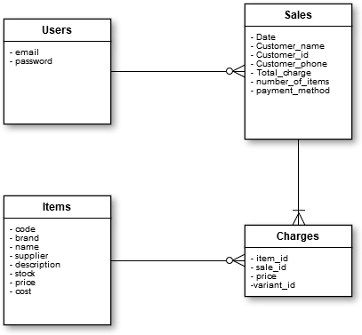

# León

León is an app developed to manage the inventory of a small store (stock management), so that you can know what products are in it, for this purpose it was not necessary a complex software with bar code management, or large quantities, as there is in majority of available applications. It only offers the possibility of adding a list of products and a list of sales, which will discount the inventory of each product as they are registered.


There's an sketch of Classes that I used



Here it will be available, for those who need a small software to manage a small store, they want to use it as a base for any larger project or as an educational tool. As I use it for my store you'll find some of the labels, messages and titles are in spanish, but I've been put an effort on coding in english.

## Getting Started

León was an exercise to develop an application from scratch, using Windows 10 as an operating system to develop, requires Rails 5.1.5, SQLite3. Therefore, is up to you what changes you have to make, if you want to use another OS.

### Prerequisites

Ther's some of the gems that I've added to the GemFile, besides the gems created on the standar generation

```
# Bootstrap as is in https://github.com/twbs/bootstrap-rubygem/blob/master/README.md or http://getbootstrap.com/docs/4.0/getting-started/download/
gem 'bootstrap', '~> 4.0.0'
# font-awesome-rails provides the Font-Awesome web fonts and stylesheets as a Rails engine for use with the asset pipeline.
gem 'font-awesome-rails'
# Easily Autocomplete widget.
gem "select2-rails"
# Use ActiveModel has_secure_password
gem 'bcrypt', platforms: [:ruby, :x64_mingw]
#Adding Authentication with Devise
gem 'devise'
#Cocoon makes it easier to handle nested forms.
gem "cocoon"
# Will Paginate in Rails 5 where I'd to add a renderer on aplication_controller_renderer.rb to match will_paginate with styles of Bootstrap 4
gem 'will_paginate', '>= 3.1'  
```

### Instalation

So you have to
```
bundle install
rake db:migrate
rake db:seed
```
then you can use 
```
user: administrador@test.com    password: administrador     => for the manager of the store
user: vendedor@test.com         password: vendedor          => for the salesman of the store.

```


### Troubles 
Every time I run the 
```
bundle install
```
It explodes bad time! With the error
```
bcrypt.rb:16:in `require': cannot load such file -- bcrypt_ext (LoadError)
```
I Have been correcting it using 

```
gem uninstall bcrypt-ruby
gem uninstall bcrypt
gem install bcrypt --platform=ruby

```
If you have a better solution for windows 10 development, I'll appreciate it.


## Authors

* **Juan Cedano* Colombia - [juanicolasc](https://github.com/juanicolasc)

## License

This project is licensed under the MIT License - see the [LICENSE.md](LICENSE.md) file for details

## TO DO

There's a lot of things to do here, for instance:

* create a variant model for increase precision on inventory.
* add the remain configuration of devise to send emails.
* create a good CRUD  for administrator so he(she) can create salesman users 
* Add order on click of every header in those index pages.